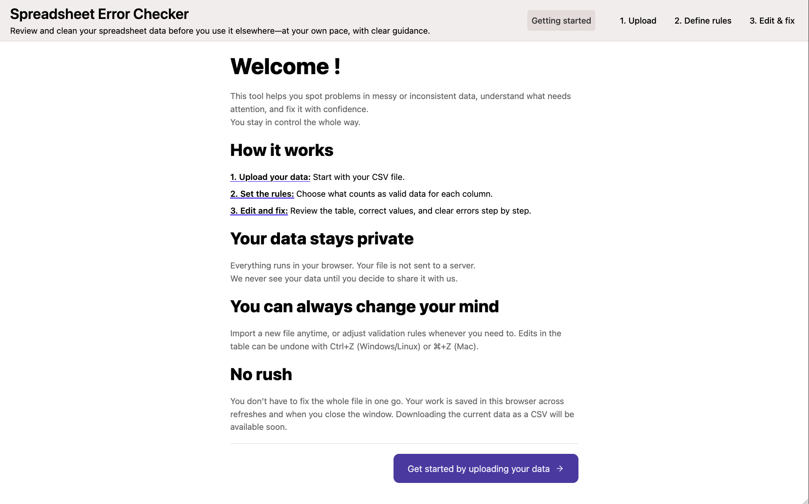
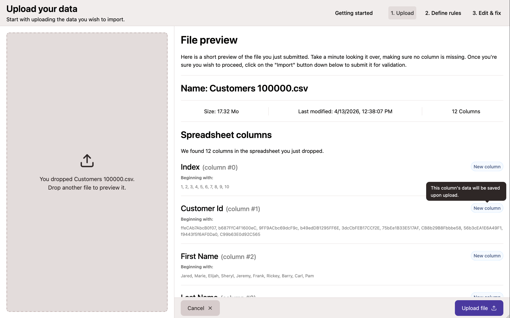
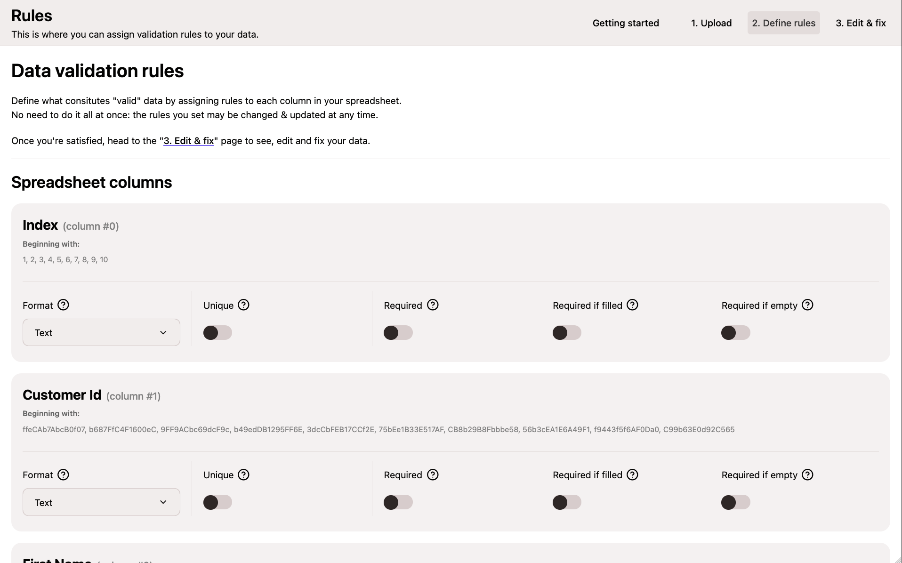
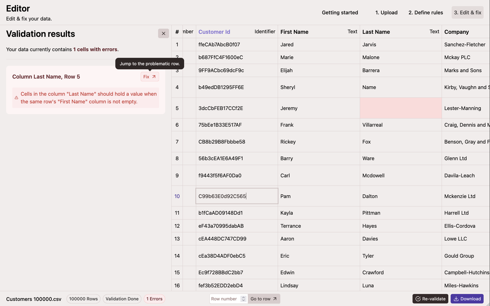

# Ingestro case study

A browser-only **Spreadsheet Error Checker**: upload a CSV, define per-column types and validation rules, then edit cells in a virtualized table while reviewing errors and hints. Processing stays on your machine; nothing is sent to a server.

## Features

- **CSV import** via drag and drop, with parsing and a short preview before you continue.
- **Schema configuration** for each column: types such as string, number, boolean, date, email, phone, URL, currency, ID, and UUID.
- **Validation rules** including required fields, uniqueness, and conditional requirements based on other columns in the same row.
- **Editor** with a large virtualized grid, an error panel with navigable issues, and undo support (Ctrl+Z or Cmd+Z).
- **Persistence** of loaded data in the browser (IndexedDB) across refreshes and sessions.
- **Validation** runs in Web Workers so the UI stays responsive on big files.

## Routes

| Path | Page | Screenshot |
| --- | --- | --- |
| `/` | Home |  |
| `/upload` | Importer |  |
| `/rules` | Schema configurator |  |
| `/editor` | Editor |  |

## Getting started

Prerequisites: [Node.js](https://nodejs.org/) **22.21.x** and [Bun](https://bun.sh/).

```sh
bun install
bun run dev
```

Or with just:

```sh
just install
just dev
```

Then open the URL shown in the terminal (typically `http://localhost:5173`).

Other scripts:

- `bun run build` – typecheck and production build
- `bun run preview` – serve the production build locally
- `bun run lint` – run ESLint

## Sample CSVs

The [`inputs/`](inputs/) directory contains CSV files you can upload in the app to try imports, rules, and the editor at different sizes.

## Stack

- **UI:** React 19, TypeScript, [Vite](https://vitejs.dev/), [Tamagui](https://tamagui.dev/), [Motion](https://motion.dev/)
- **State:** [@legendapp/state](https://legendapp.com/open-source/state/) with IndexedDB persistence
- **Routing:** [React Router](https://reactrouter.com/) 7
- **Data:** [PapaParse](https://www.papaparse.com/) for CSV, [react-dropzone](https://react-dropzone.js.org/) for uploads, [react-virtuoso](https://virtuoso.dev/) for the table
- **Tooling:** [Bun](https://bun.sh/) (package manager and scripts), ESLint, [React Compiler](https://react.dev/learn/react-compiler) (Babel)

## Architecture design document & decision records

See the main [Architecture & UX design document](docs/design.md) for an overview, workflow, and rationale behind core decisions.


For recorded design choices (ADRs), see the [`docs/decisions/`](docs/decisions/) directory.
